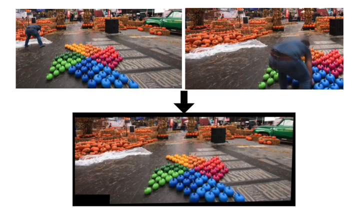
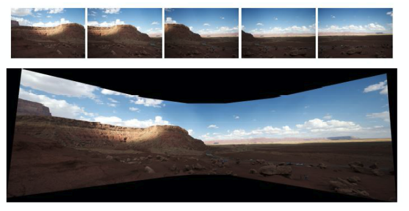

# Image Stitching Project – Background Stitching and Image Panorama

## Overview
In this project, I tackled the intriguing challenges of image stitching and creating image panoramas. The focus was on creating seamless mosaics by combining multiple images with a common background but different foreground elements, as well as stitching together a panoramic photo from a series of overlapping images.

## Objective
The primary goal was to experiment with advanced image stitching techniques to merge images into cohesive units, both for background stitching and panoramic views. Key aspects included effectively eliminating moving foreground objects and ensuring smooth transitions in panoramic compositions.

## Methodology
The process involved several critical steps, applicable to both background stitching and image panorama tasks:

### Feature Extraction
Distinctive features from each image were extracted to facilitate accurate matching.

### Feature Matching
These features were compared to determine overlapping areas between pairs of images.

### Homography Computation
With overlaps identified, homographies were computed to align and stitch the images together.

### Image Transformation and Stitching
The images were transformed based on the computed homographies, crucial for stitching them into single images while removing inconsistencies.

### Resulting Mosaic and Panorama
The final steps were to create and save the mosaics and the panoramic photo as per the project specifications. Handling the irregular shape of the output images was a significant challenge, as cropping of transformed images was not permitted.

## Image Panorama Specifics
For the image panorama task, the objective was to stitch together four or more images into a panoramic photo. The approach involved:

- Automatically determining spatial overlaps among images.
- Saving overlap results in a one-hot array format.
- Conducting image transformations and stitching all into one panoramic photo.

## Technologies Used
- **PyTorch**: Utilized for its powerful machine learning capabilities, particularly in handling and processing image data.
- **Kornia**: Employed for computer vision operations and for implementing state-of-the-art algorithms. Kornia was particularly useful for homography computation and feature detection tasks in this project. 
- **Restrictions**: The project did not use common libraries such as `cv2`, `numpy`, `PIL`, or `imageio` for image-related operations. 

## Additional Notes
- Kornia within the PyTorch ecosystem was explored as an efficient alternative for computer vision tasks, aligning with the project's constraints and providing deeper insights into PyTorch's capabilities in image processing.

## Further Information on Kornia
For more details about Kornia and its applications in computer vision, visit [Kornia's official documentation or website](https://kornia.org).

## Outcome
The project successfully demonstrated the use of computer vision techniques in image processing, specifically in the context of image stitching, foreground elimination, and panorama creation.

## Screenshots/Results

